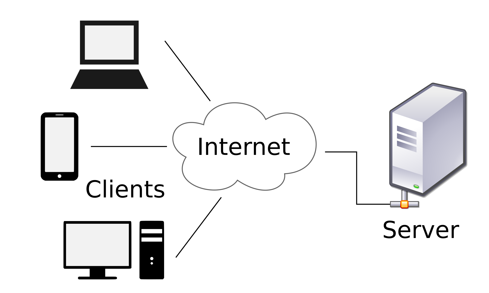

## Question 1: How Does Client-Server Architecture Work?

Client-server architecture is a model where a client (a device or user) requests services from a server, which provides those services. It is the foundation of most modern networked applications such as websites, apps, and games.

### How It Works:

1. **Client Sends Request:**
   - A client (like a web browser or mobile app) sends a request to the server (e.g., asking for a web page or specific data).

2. **Server Processes Request:**
   - The server receives the request, processes it (e.g., retrieves data from a database), and prepares a response.

3. **Server Sends Response:**
   - The server sends the requested data or output back to the client.

4. **Client Receives Response:**
   - The client receives the response and uses the data (e.g., displays a webpage or product list).

   ### Client-Server Architecture:

---

## Question 2: What are the factors to be considered when designing a software?

### a. Understanding User Needs:
- **Functional Requirements:** Define what the software must do.
- **Non-Functional Requirements:** Address speed, security, usability, and scalability.

### b. Enhancing User Experience (UX):
- **Ease of Use:** The interface should be simple and intuitive.
- **Inclusive Access:** Ensure accessibility for users with disabilities.
- **Visual Consistency:** Maintain a clean and uniform design.

### c. Organizing Software Design:
- **Scalability:** Software should support growth in users and data.
- **Simple Maintenance:** Easy to update and debug.
- **Modularity:** Break the software into reusable, independent components.

### d. Selecting the Proper Technology:
- **Language Choice:** Choose based on project and developer skills.
- **Development Tools:** Use frameworks/libraries for faster development.
- **Target Environment:** Decide on web, mobile, or desktop platforms.

### e. Guaranteeing High Performance:
- **Fast Operation:** Ensure quick response times.
- **Efficient Resource Use:** Minimize CPU, memory, and other resource usage.

### f. Security:
- **Protecting Information:** Prevent unauthorized data access.
- **Verifying Access:** Use authentication and authorization methods.
- **Data Encryption:** Protect data during transfer and storage.

### g. Testing and Quality Control:
- **Automated Testing:** Catch bugs early.
- **Manual Evaluation:** Handle complex or special scenarios.
- **Ongoing Integration:** Use continuous integration for updated, tested software.

### h. Proper Documentation:
- **Developer Notes:** Add comments and documentation in code.
- **End-User Guides:** Create manuals and help sections for users.

---

## Question 3: Why Do We Really Need Network Programming Tools and Platforms?

Network programming tools and platforms are essential for:

- **Facilitating Communication:** Enable data exchange between computers and applications.
- **Ensuring Security:** Protect against unauthorized access and threats.
- **Simplifying Debugging:** Identify and fix network problems.
- **Improving Performance:** Speed up and streamline data transfer.
- **Supporting Online Applications:** Develop and maintain web apps like e-commerce platforms.

### Popular Network Programming Tools and Platforms:

1. **Wireshark (Network Traffic Analyzer):**
   - Monitors and analyzes network activity.
   - Useful for troubleshooting and security analysis.

2. **Postman (API Testing Tool):**
   - Sends/receives web service requests.
   - Helps test APIs and web applications.

3. **Node.js with socket.io (Real-Time Communication):**
   - Builds real-time apps like chat or multiplayer games.

4. **OpenSSL (Encryption Tool):**
   - Provides encryption for secure communication.
   - Ensures websites use HTTPS.
