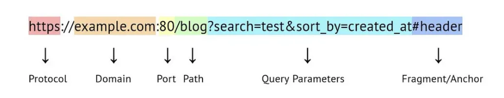

# 1. What is URL? Give an example of a URL that shows each component of URL. (With Diagram)

## URL (Uniform Resource Locator) Explanation
A URL is the address used to access a resource on the internet, such as a webpage, image, video, or file. It specifies the location of the resource, and the protocol used to retrieve it.

**Example URL:**  
`https://www.example.com:8080/docs/index.html?search=java#section2`

### Components of a URL

1. **Protocol:**  
   - **Definition:** The method used to access the resource. It determines how data is transferred between the client and server.  
   - **Example:** `https`  
   - **Explanation:** This is the secure version of HTTP, which ensures encrypted communication between the client and the server.

2. **Host (Domain Name):**  
   - **Definition:** The server's address on the internet where the resource is hosted.  
   - **Example:** `www.example.com`  
   - **Explanation:** This is the domain name of the server, directing the browser to the server hosting the resource.

3. **Port:**  
   - **Definition:** The port number used for the connection to the server.  
   - **Example:** `8080`  
   - **Explanation:** This specifies the port number through which the server will communicate. Port 8080 is often used for non-standard HTTP services.

4. **Path:**  
   - **Definition:** The location of the resource on the server.  
   - **Example:** `/docs/index.html`  
   - **Explanation:** This is the path to the file index.html located within the docs directory on the server.

5. **Query:**  
   - **Definition:** Extra data sent to the server.  
   - **Example:** `?search=java`  
   - **Explanation:** A query string containing a key-value pair (search=java), often used to send parameters to the server.

6. **Fragment (Reference):**  
   - **Definition:** A reference to a specific part of the resource.  
   - **Example:** `#section2`  
   - **Explanation:** This directs the browser to a specific section within the resource.

---

## Diagrammatic Representation of URL



---


### 2. URLs vs URIs with examples for each. Can all URLs be URIs? Why?

#### Differences between URL and URI:

| Feature             | URL (Uniform Resource Locator)                       | URI (Uniform Resource Identifier)                  |
|---------------------|-----------------------------------------------------|----------------------------------------------------|
| Definition          | Specifies the location and how to access a resource | Identifies a resource by name or location         |
| Purpose             | Locates and accesses a resource                     | Identifies a resource                             |
| Protocol Included   | Yes (e.g., http, ftp)                               | Not required                                       |
| Subset/Superset     | Subset of URI                                       | Superset (includes URL and URN)                  |
| Accessibility       | Resource is directly accessible                     | May not be accessible (e.g., URNs)                |

#### Examples:
- **URL Example:** `https://www.example.com/file.html`
  - It tells where the resource is and how to access it (using HTTPS).

- **URI Example:** `urn:isbn:0451450523`
  - It uniquely identifies a resource (like a book) by its ISBN, but doesn’t tell how to locate or access it.


#### Can all URLs be URIs?
Yes, all URLs are URIs because a URL is a specific type of URI that:
- Identifies a resource,
- Provides the location of the resource,
- Specifies how to access the resource (protocol).

However, **not all URIs are URLs**. Some URIs (like URNs) only identify the resource but do not provide access information.


---
### Question No 3
### 1. Illustrate Important Methods of URL Class
```java
import java.net.*;

public class UrlImportantMethods {
    public static void main(String[] args) throws Exception {
        URL site = new URL("https://rohan.com.np/index.html");
        System.out.println("Protocol: " + site.getProtocol());
        System.out.println("Host: " + site.getHost());
        System.out.println("Port: " + site.getPort());
        System.out.println("File: " + site.getFile());
        System.out.println("Path: " + site.getPath());
    }
}
```

---

### 2. Retrieve Data from a URL
```java
import java.net.*;
import java.io.*;

public class URLDataRetriever {
    public static void main(String[] args) throws Exception {
        URL url = new URL("https://www.w3.org/TR/PNG/iso_8859-1.txt");
        BufferedReader in = new BufferedReader(new InputStreamReader(url.openStream()));

        String inputLine;
        while ((inputLine = in.readLine()) != null)
            System.out.println(inputLine);
        in.close();
    }
}
```

---

### 3. Check Equality of URLs
```java
import java.net.*;

public class URLEqualityDemo {
    public static void main(String[] args) throws Exception {
        URL url1 = new URL("https://www.example.com/docs/page.html");
        URL url2 = new URL("https://www.example.com/docs/page.html");

        System.out.println("url1.equals(url2): " + url1.equals(url2));
        System.out.println("url1.sameFile(url2): " + url1.sameFile(url2));
    }
}
```
**Use Case**:
- `equals()` checks the entire URL including query and fragment.
- `sameFile()` checks if both URLs refer to the same file ignoring query and fragment.

---

### 4. Encode and Decode Special Characters using URLEncoder
```java
import java.net.*;

public class URLEncoderDemo {
    public static void main(String[] args) throws Exception {
        String original = "ashok damase@example.com";

        String encoded = URLEncoder.encode(original, "UTF-8");
        System.out.println("Encoded: " + encoded);

        String decoded = URLDecoder.decode(encoded, "UTF-8");
        System.out.println("Decoded: " + decoded);
    }
}
```

---

### 5. Access Password Protected Site using Default Authentication
```java
import java.net.*;
import java.io.*;

public class URLDefaultAuth {
    public static void main(String[] args) throws Exception {
        Authenticator.setDefault(new Authenticator() {
            protected PasswordAuthentication getPasswordAuthentication() {
                return new PasswordAuthentication("admin", "admin123".toCharArray());
            }
        });

        URL url = new URL("http://httpbin.org/basic-auth/admin/admin123");
        BufferedReader reader = new BufferedReader(new InputStreamReader(url.openStream()));

        String line;
        while ((line = reader.readLine()) != null)
            System.out.println(line);
        reader.close();
    }
}
```

---

### 6. Access Password Protected Site with User Prompt
```java
import java.net.*;
import java.io.*;
import java.util.*;

public class URLPromptAuth {
    public static void main(String[] args) throws Exception {
        Scanner scanner = new Scanner(System.in);

        System.out.print("Enter username: ");
        String username = scanner.nextLine();

        System.out.print("Enter password: ");
        String password = scanner.nextLine();

        Authenticator.setDefault(new Authenticator() {
            protected PasswordAuthentication getPasswordAuthentication() {
                return new PasswordAuthentication(username, password.toCharArray());
            }
        });

        URL url = new URL("http://httpbin.org/basic-auth/admin/admin123");
        BufferedReader reader = new BufferedReader(new InputStreamReader(url.openStream()));

        String line;
        while ((line = reader.readLine()) != null)
            System.out.println(line);
        reader.close();
    }
}
```


