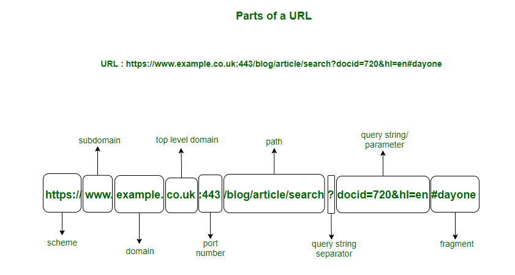

Question 1: What is URL? Give an example of a URL that shows each components of URL. Diagrammatic representation is more preferred.

Answer:

A URL (Uniform Resource Locator) is the address used to access resources on the internet. It is essentially a reference to a specific resource (like a webpage, file, or image) that can be retrieved by a web browser.


---------------------------------------------------------------------------------------------------------------------------------------------------------------------------------------
---------------------------------------------------------------------------------------------------------------------------------------------------------------------------------------
---------------------------------------------------------------------------------------------------------------------------------------------------------------------------------------

Question 2:URLs vs URIs with examples for each. Can all URLs be URIs? Why?

Answer:

URI (Uniform Resource Identifier):
A URI is a broader concept that refers to any string of characters used to identify a resource, either by location, name, or both. A URI can be further classified into two categories: URL and URN (Uniform Resource Name). Essentially, every URL is a URI, but not every URI is a URL.

Example of URI:
urn:isbn:0451450523
This is a URN, a type of URI, identifying a specific book by its ISBN number, without specifying where the book is located.

Another example of URI:
https://www.example.com/index.html
This is also a URI, but more specifically, it’s a URL as it indicates both the resource's location and the protocol for accessing it.


URL (Uniform Resource Locator):
A URL is a type of URI that not only identifies a resource but also provides a means of locating it (i.e., accessing it via a protocol such as HTTP, FTP, etc.). A URL includes information like the protocol, domain, path, and possibly a query or fragment.

Example of URL:
https://www.example.com/index.html
This is a URL because it specifies the location of the resource (www.example.com) and how to access it (using the https protocol).

All URLs are URIs, but not all URIs are URLs. URLs are a subset of URIs that specify not just the identification of a resource, but also how to access it (through a specific protocol or method).

A URI could be something like urn:isbn:0451450523, which identifies a resource but doesn't necessarily tell you how to access it. A URL like http://www.example.com/index.html gives you both the resource identifier and how to retrieve it via HTTP.

---------------------------------------------------------------------------------------------------------------------------------------------------------------------------------------
---------------------------------------------------------------------------------------------------------------------------------------------------------------------------------------
---------------------------------------------------------------------------------------------------------------------------------------------------------------------------------------

Question 3:Write a JAVA program for each of the following:
Answer:

###########<-----Java program To illustrate important methods of URL class.----->##################
```java
import java.net.*;

public class URLMethodsExample {
    public static void main(String[] args) throws Exception {
        // Create URL object
        URL url = new URL("https://www.example.com:8080/docs/index.html?name=JohnDoe#section2");
        
        // Display the URL components using methods
        System.out.println("URL: " + url);
        System.out.println("Protocol: " + url.getProtocol());
        System.out.println("Host: " + url.getHost());
        System.out.println("Port: " + url.getPort());
        System.out.println("Path: " + url.getPath());
        System.out.println("Query: " + url.getQuery());
        System.out.println("File: " + url.getFile());
        System.out.println("Reference: " + url.getRef());
    }
}
```

###########<-----Java program To retrieve data from a URL. Use different URL than used in the program----->##################
```java
import java.net.*;
import java.io.*;

public class RetrieveDataFromURL {
    public static void main(String[] args) throws Exception {
        URL url = new URL("https://www.example.com");
        BufferedReader in = new BufferedReader(new InputStreamReader(url.openStream()));
        String inputLine;
        
        // Print data retrieved from the URL
        while ((inputLine = in.readLine()) != null) {
            System.out.println(inputLine);
        }
        in.close();
    }
}
```

###########<-----Java program To check equality of URLs. Describe use case for equals() and sameFile() methods.----->##################
```java
import java.net.*;

public class URLEqualityCheck {
    public static void main(String[] args) throws Exception {
        URL url1 = new URL("https://www.example.com");
        URL url2 = new URL("https://www.example.com");
        URL url3 = new URL("https://www.example.org");

        // Using equals() to check if URLs are identical
        System.out.println("url1.equals(url2): " + url1.equals(url2)); // true, same protocol, host, and path
        System.out.println("url1.equals(url3): " + url1.equals(url3)); // false, different host
        
        // Using sameFile() to check if URLs refer to the same resource
        System.out.println("url1.sameFile(url2): " + url1.sameFile(url2)); // true, same host, protocol
        System.out.println("url1.sameFile(url3): " + url1.sameFile(url3)); // false, different host
    }
}
```

###########<-----Java program To demo encoding and decoding of special characters using URLEncoder class----->##################
```java
import java.net.*;

public class URLEncoderDecoderExample {
    public static void main(String[] args) throws Exception {
        // String with special characters
        String str = "Hello World! How's everything?";
        
        // Encode the string
        String encodedString = URLEncoder.encode(str, "UTF-8");
        System.out.println("Encoded String: " + encodedString);

        // Decode the string
        String decodedString = URLDecoder.decode(encodedString, "UTF-8");
        System.out.println("Decoded String: " + decodedString);
    }
}
```
###########<-----Java program To access password protected site using default authentication----->##################
```java
import java.net.*;
import java.io.*;

public class DefaultAuthExample {
    public static void main(String[] args) throws Exception {
        String username = "alex";
        String password = "bhusal";
        
        // Construct the URL for the password-protected site
        URL url = new URL("https://example.com/protected");

        // Create URLConnection and set up basic authentication
        URLConnection connection = url.openConnection();
        String encodedCredentials = new String(Base64.getEncoder().encode((username + ":" + password).getBytes()));
        connection.setRequestProperty("Authorization", "Basic " + encodedCredentials);
        
        // Get the data from the site
        BufferedReader in = new BufferedReader(new InputStreamReader(connection.getInputStream()));
        String inputLine;
        
        // Print the data
        while ((inputLine = in.readLine()) != null) {
            System.out.println(inputLine);
        }
        in.close();
    }
}
```
###########<-----Java program To access password protected site asking user to promt for username and password.----->##################
```java
import java.net.*;
import java.io.*;
import java.util.Base64;
import java.util.Scanner;

public class UserAuthExample {
    public static void main(String[] args) throws Exception {
        Scanner scanner = new Scanner(System.in);

        // Prompt user for username and password
        System.out.print("Enter username: ");
        String username = scanner.nextLine();
        System.out.print("Enter password: ");
        String password = scanner.nextLine();

        // Construct the URL for the password-protected site
        URL url = new URL("https://example.com/protected");

        // Create URLConnection and set up basic authentication
        URLConnection connection = url.openConnection();
        String encodedCredentials = new String(Base64.getEncoder().encode((username + ":" + password).getBytes()));
        connection.setRequestProperty("Authorization", "Basic " + encodedCredentials);
        
        // Get the data from the site
        BufferedReader in = new BufferedReader(new InputStreamReader(connection.getInputStream()));
        String inputLine;
        
        // Print the data
        while ((inputLine = in.readLine()) != null) {
            System.out.println(inputLine);
        }
        in.close();
    }
}
```


