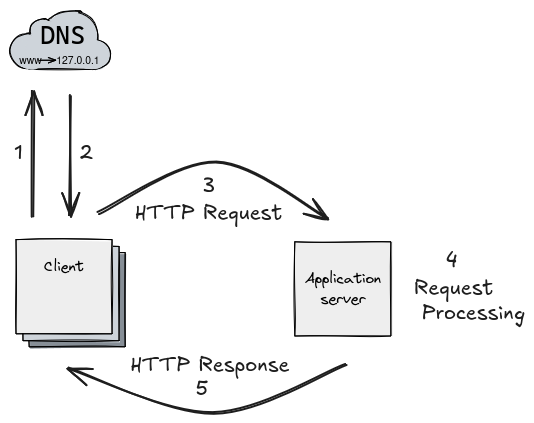

# How does client server architecture works?

A `client-server architecture` is a system where one main computer (the server) provides and manages resources or services that other computers (the clients) ask for. There are two main parts in this model: the `server` and the `clients`. The server stores things like data, files, or services. When a client asks for something, the server receives the request, processes it, and sends back the result.

**Servers:**
Servers are high-performance systems or devices designed to provide services, resources, or data to client machines. These systems are typically configured to handle multiple incoming client requests concurrently. They act as centralized entities, waiting for client requests over a network and responding with the requested data or service. In technical terms, a server might be a physical or virtual machine hosting software that manages and processes client interactions.

**Communication:**
Client-server communication occurs over a network, such as the internet or a local area network (LAN). When a client sends a request (typically in the form of an HTTP request or other network protocol), it is transmitted over the network to the server. The server processes the request, often interacting with databases or services, and sends back a response (e.g., HTTP response, data packet).

**Request-Response Model:**
The client-server communication model usually follows the request-response paradigm. In this model, the client sends a request for a specific service (such as an HTTP GET request or API call), and the server processes that request and sends back a response. The server typically performs business logic, queries databases, or interacts with other services to fulfill the client’s request.

# What are the factors to be considered when designing a software ?

By considering these key factors, we can create efficient, high-quality software:

1. `Software Type and Size:`
   Think about what kind of software you need , big or small. Different software types require different strategies. For large scale systems, you may need complex architecture, while small apps might need quicker, more agile methods. Understanding the scope upfront helps in selecting the right approach, tools, and resources.

2. `Learning from Past Projects:`
   Look at similar projects to avoid mistakes and use methods that worked well before. By learning from past experiences, you can identify common pitfalls and best practices that help you build smarter and faster. This also reduces the chances of reinventing the wheel and improves efficiency.

3. `User Needs:`
   Understand what the users want. Gathering clear and accurate feedback is key to creating software they will actually use and love. Engaging with users early and regularly ensures your software aligns with their expectations, improving both usability and satisfaction. Focus on solving their problems, not just adding features.

4. `Tools and Techniques:`
   Choose the right tools for the job. Using the right programming languages, frameworks, and technologies makes development easier and faster. Whether it’s a specific framework that enhances productivity or a tool that ensures security, selecting appropriate technologies minimizes technical debt and improves the final product’s performance.

5. `Risks:`
   Identify any potential problems early. Think about technical, financial, and timing risks, and plan how to handle them. Anticipating risks, such as unexpected budget overruns, technical challenges, or project delays, helps you prepare strategies to mitigate them, ensuring the project stays on track even when things don’t go as planned.

# Why do we really need network programming tools and platform? Explain some of them

Network programming tools and platforms are essential for enabling `communication` between computers in a network. They help in `sending` and `receiving` data by providing necessary interfaces like `sockets`. These tools are crucial for managing network protocols such as `TCP` and `UDP`. They ensure that data is transmitted efficiently and securely between systems. Platforms also offer debugging, testing, and monitoring capabilities for networked applications. In Java, the java.net package provides key support for common networking protocols.

**Some Tools and Platforms are:**

**Wireshark:**
Captures and inspects network traffic to debug network-related issues. It provides detailed packet-level information for protocols such as TCP/IP, UDP, and HTTP.

**Telnet:**
Used to test server connections by allowing manual interaction with a remote server over TCP. It’s commonly used to verify open ports and troubleshoot network connections.

**SSH (Secure Shell):**
Provides secure remote access to servers for management and data transfer. It encrypts communications to ensure privacy and integrity during network communication.

**Curl:**
A command-line tool for transferring data with URLs. It supports multiple protocols, including HTTP, FTP, and others, and is commonly used to test APIs, download files, and debug server responses.
