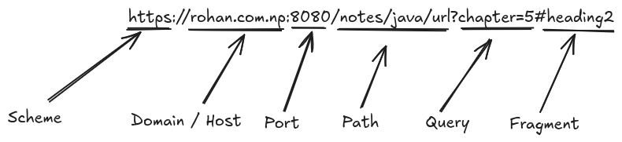
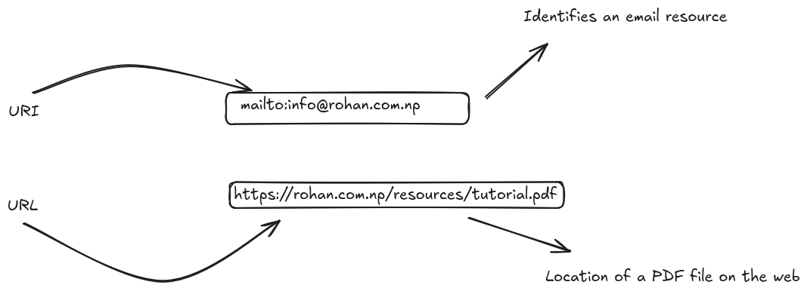

# What is URL? Give an example of a URL that shows each components of URL. Diagrammatic representation is more preferred.

A URL (Uniform Resource Locator) is the address used to access resources (like web pages, files, images, etc.) on the internet. It tells the browser where to find the resource and how to fetch it.

```url
https://rohan.com.np:8080/notes/java/url?chapter=5#heading2
```



```java
import java.net.*;

public class UrlComponents {
    public static void main(String[] args) {
        try {
            URL url = new URL("https://rohan.com.np:8080/notes/java/url?chapter=5#heading2");

            System.out.println("Scheme: " + url.getProtocol());
            System.out.println("Host: " + url.getHost());
            System.out.println("Port: " + url.getPort());
            System.out.println("Path: " + url.getPath());
            System.out.println("Query: " + url.getQuery());
            System.out.println("Fragment: " + url.getRef());

        } catch (MalformedURLException e) {
            System.out.println("Invalid URL");
        }
    }
}
```

# URLs vs URIs with examples for each. Can all URLs be URIs? Why?

`URI (Uniform Resource Identifier)`
A `URI` is a general identifier for a resource. it can be divided into two types:

- URL (Locator) – tells you where to find a resource.
- URN (Name) – tells you the name of a resource, regardless of location.

`URL (Uniform Resource Locator)`
A URL is a specific kind of URI.

- It always tells where and how to access a resource (includes protocol like http, ftp, etc.).
- A URL is used to access web pages, download files, etc.



From all these example we can conclude that, all URLs are URIs because they identify and locate resources, But not all URIs are URLs, as some only name the resource without giving its location.

# Program to demonstrate important methods of url class

```java
import java.net.*;

public class UrlImportantMethods {
    public static void main(String[] args) throws Exception {
        URL site = new URL("https://rohan.com.np/index.html");
        System.out.println("Protocol: " + site.getProtocol());
        System.out.println("Host: " + site.getHost());
        System.out.println("Port: " + site.getPort());
        System.out.println("File: " + site.getFile());
        System.out.println("Path: " + site.getPath());
    }
}
```

# Program to retrieve data from url

```java
import java.net.*;
import java.io.*;

public class URLDataRetrieval {
    public static void main(String[] args) throws Exception {
        URL url = new URL("https://jsonplaceholder.typicode.com/posts");
        BufferedReader reader = new BufferedReader(new InputStreamReader(url.openStream()));
        String inputLine;
        while ((inputLine = reader.readLine()) != null) {
            System.out.println(inputLine);
        }
        reader.close();
    }
}
```

# Program to check equality of url

```java
import java.net.*;

public class URLEqualityCheck {
    public static void main(String[] args) throws Exception {
        URL url1 = new URL("https://jsonplaceholder.typicode.com/posts");
        URL url2 = new URL("https://jsonplaceholder.typicode.com/posts");

        System.out.println("Equals: " + url1.equals(url2));
        System.out.println("Same file: " + url1.sameFile(url2));
    }
}
```

# Program to demonstrate encoding and decoding special characters using `URLEncoder` class

```java
import java.net.*;

public class EncodeDecode {
    public static void main(String[] args) throws Exception {
        String original = "Hello World";
        String encoded = URLEncoder.encode(original, "UTF-8");
        System.out.println("Encoded: " + encoded);
        String decoded = java.net.URLDecoder.decode(encoded, "UTF-8");
        System.out.println("Decoded: " + decoded);
    }
}
```

# Program to access password protected site using default authentication

```java
import java.net.*;
import java.io.*;

public class URLAuth {
    public static void main(String[] args) throws Exception {
        Authenticator.setDefault(new Authenticator() {
            protected PasswordAuthentication getPasswordAuthentication() {
                return new PasswordAuthentication("user", "pass".toCharArray());
            }
        });
        URL url = new URL("https://httpbin.org/basic-auth/user/pass");
        BufferedReader reader = new BufferedReader(new InputStreamReader(url.openStream()));
        String inputLine;
        while ((inputLine = reader.readLine()) != null) {
            System.out.println(inputLine);
        }
        reader.close();
    }
}
```

# Program to access password protected site prompting user

```java
import java.net.*;
import java.io.*;
import java.util.*;

public class URLPromptAuth {
    public static void main(String[] args) throws Exception {
        Scanner scanner = new Scanner(System.in);
        System.out.print("Enter username: ");
        String user = scanner.nextLine();
        System.out.print("Enter password: ");
        String pass = scanner.nextLine();

        Authenticator.setDefault(new Authenticator() {
            protected PasswordAuthentication getPasswordAuthentication() {
                return new PasswordAuthentication(user, pass.toCharArray());
            }
        });

        URL url = new URL("https://httpbin.org/basic-auth/user/pass");
        BufferedReader reader = new BufferedReader(new InputStreamReader(url.openStream()));
        String inputLine;
        while ((inputLine = reader.readLine()) != null) {
            System.out.println(inputLine);
        }
        reader.close();
    }
}
```
