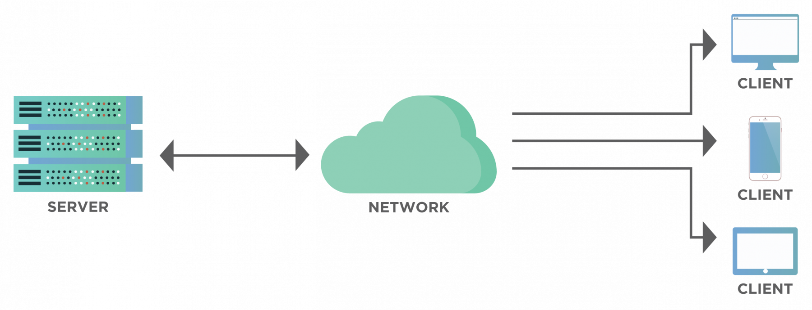

# Client-Server Architecture
Client-Server architecture is a model where clients (users) request services from a central server. The server processes the request, retrieves the necessary data, and sends it back to the client.

## How it works:
- The **client** sends a request (e.g., accessing a website, fetching data).
- The **server** processes the request and responds with the requested information.
- Communication happens through network protocols like HTTP, FTP, or TCP/IP.

**Example:** A web browser (client) requests a webpage from a web server, and the server responds with the webpage content.

---

# Factors to Consider When Designing Software
When designing software, several factors need to be considered:

1. **Requirements Analysis** – Understanding what the software needs to do.
2. **User Experience (UX)** – Making it easy and efficient for users.
3. **Security** – Protecting data from unauthorized access.
4. **Scalability** – Ensuring it can handle more users in the future.
5. **Performance** – Fast response time and efficient resource use.
6. **Maintainability** – Easy to update and fix issues.
7. **Compatibility** – Works across different devices and systems.

**Example:** While designing a mobile app, ensuring it works on both Android and iOS is a compatibility factor.

---

# Why Do We Need Network Programming Tools and Platforms?
Network programming tools and platforms help developers create applications that communicate over networks like the internet. They are essential for:

- **Enabling Communication** – Allows different devices to exchange data (e.g., emails, messaging apps).
- **Remote Access** – Enables remote working, cloud storage, and online gaming.
- **Efficiency & Automation** – Automates tasks like data synchronization and backups.

## Some Network Programming Tools & Platforms:
1. **Sockets (TCP/UDP)** – Used for direct communication between applications.
2. **Postman** – API testing tool for client-server interactions.
3. **Wireshark** – Network traffic monitoring tool.
4. **Node.js** – A platform for building scalable network applications.

**Example:** A video streaming app like Netflix needs network programming to send and receive video data efficiently.
