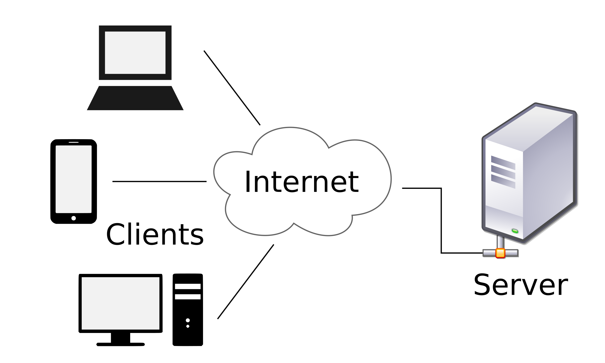

## Question 1: How Does Client-Server Architecture Work?

Client-server architecture is the backbone of most modern web services and networked applications. In this model, clients (such as web browsers, mobile devices, or applications) interact with servers to request resources or perform operations. Servers, on the other hand, are powerful systems that provide these services or data in response.

### How It Works:

1. **Client Makes a Request:**

   - A client (e.g., a browser or mobile app) initiates a request, asking the server for specific data or services (e.g., retrieving a webpage or requesting information from a database).

2. **Server Handles the Request:**

   - The server receives the request, processes it, and fetches the requested information from its database or performs a computation.

3. **Response is Sent Back:**

   - Once the server completes the task, it sends the response (data, results, etc.) back to the client.

4. **Client Uses the Response:**
   - The client processes the data and presents it to the user (e.g., displaying a webpage, showing an image, or populating a list).

---

## Question 2: What are the factors to be considered when designing software?

When designing software, numerous factors ensure that it meets both the business and technical needs. The following key aspects need careful consideration:

### a. Understanding User Requirements:

- **Functional Needs:** What should the software do? It's vital to understand the exact functionality needed.
- **Non-Functional Requirements:** How should the software perform? This includes scalability, security, usability, and speed.

### b. Optimizing User Experience (UX):

- **User Interface (UI):** Make sure the interface is user-friendly, intuitive, and visually appealing.
- **Accessibility:** Ensure that people with disabilities can use the software efficiently.
- **Consistency:** Design should be coherent across the entire system to avoid user confusion.

### c. Structuring Software for Efficiency:

- **Scalability:** Can the software handle increasing user load or data growth over time?
- **Maintainability:** How easy is it to maintain, debug, and update the software?
- **Modularity:** The system should be divided into smaller, reusable components that are easier to manage.

### d. Choosing the Right Technology:

- **Programming Language:** Choose a language based on the complexity of the project and the team's expertise.
- **Development Tools:** Utilize frameworks and libraries to speed up development.
- **Deployment Platform:** Whether the software is intended for web, mobile, or desktop platforms influences the technology stack.

### e. Ensuring High Performance:

- **Response Time:** The system should respond quickly to user requests.
- **Resource Efficiency:** Minimize CPU, memory, and bandwidth usage, ensuring that resources are efficiently managed.

### f. Security Considerations:

- **Data Protection:** Prevent unauthorized access to sensitive data.
- **Authentication and Authorization:** Proper user identification and permission management.
- **Encryption:** Ensure all sensitive data is encrypted, both in transit and at rest.

### g. Quality Assurance and Testing:

- **Automated Tests:** Implement continuous testing to catch issues early in development.
- **Manual Testing:** Use human testers for complex cases or scenarios that automated testing might miss.
- **Continuous Integration (CI):** Regularly update and test the software to avoid integration problems.

### h. Documentation:

- **Code Documentation:** Maintain comprehensive documentation within the code for easy future reference.
- **User Manuals:** Provide clear guides and help sections for end-users to understand how to use the software.

---

## Question 3: Why Do We Really Need Network Programming Tools and Platforms?

Network programming tools and platforms are indispensable for building and managing modern web and distributed systems. These tools help in facilitating communication, ensuring security, and improving overall performance in networked environments.

### Key Benefits of Network Programming Tools:

- **Streamlining Communication:** They enable seamless communication between devices, servers, and applications over the network.
- **Ensuring Robust Security:** Protect against network vulnerabilities, unauthorized access, and potential cyber threats.
- **Simplifying Debugging:** Tools for monitoring network traffic and debugging help quickly identify issues in networked applications.
- **Enhancing Performance:** Network tools can optimize data transfer speed and reduce latency in real-time applications.
- **Supporting Modern Web Apps:** They are essential for developing online applications, from e-commerce to cloud-based services.

### Popular Network Programming Tools:

1. **Wireshark (Network Analyzer):**

   - A powerful tool for monitoring and analyzing network traffic in real-time.
   - It helps identify potential security issues and optimize network performance.

2. **Postman (API Testing):**

   - Helps developers send, receive, and test HTTP requests and APIs.
   - Ideal for testing web services, APIs, and microservices before deployment.

3. **OpenSSL (Security Tool):**
   - A robust toolkit for implementing encryption and secure communications, including the use of SSL/TLS for HTTPS.
   - Vital for ensuring privacy and secure data transfers over the web.
